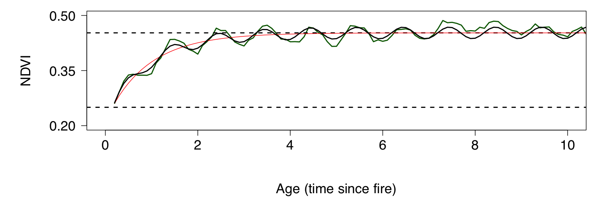

```{r setup, include=FALSE}
knitr::opts_chunk$set(echo = TRUE,  dev = "cairo_pdf")
```

# Introduction

Our understanding of and approach to studying the relationship between biodiversity and ecosystem function (B-EF) has evolved over the past few decades (Figure 1; van der Plas 2019). The historical view was one of biodiversity as the response variable, being determined by environmental and anthropogenic factors, with little feedback to ecosystem function. In the early 1990s, this shifted (and perhaps overcompensated) to focus on the causal effects of variation in biodiversity on ecosystem functioning, with little emphasis on the role of environmental variation. More recently, there is recognition that biodiversity both responds to the environment and partly drives ecosystem function in concert with environmental variation. The current focus of most B-EF research is on the relative importance of abiotic drivers (natural and anthropogenic) versus biotic variation in determining various ecosystem functions.

```{r echo = F, fig.align = 'center', out.width = '95%', fig.cap = "(from van der Plas 2019)"}
knitr::include_graphics("images/vanderplas2019_BEF.jpg")
```

The Cape Floristic Region (CFR) of South Africa is one of the most botanically diverse areas on the planet. The indigenous flora of the CFR has several components with different evolutionary and biogeographic origins (Figure 2; Bergh et al. 2014), and distinct differences in a range of ecosystem functions. The CFR also has a long history of global change impacts, from direct anthropogenic disturbance (e.g. land use / land cover) to the introduction of invasive alien species. This provides a range of highly varied ecosystem types within close proximity, that often share or contrast in their biotic composition (species, functional and phylogenetic diversity) and abiotic conditions - climate, soils and disturbance regimes (fire, herbivory).

```{r echo = F, fig.align = 'center', out.width = '60%', fig.cap = "Ordination of genus-level floristic similarities of GCFR vegetation units sensu Mucina and Rutherford (2006), as inferred on the basis of the 'important species' lists provided in The vegetation of South Africa, Lesotho and Swaziland (Mucina and Rutherford 2006). Figure from Bergh et al. 2014."}
knitr::include_graphics("images/bergh2014.png")
```

In this practical, we will explore how variation in a set of measures of biodiversity (species, functional and phylogenetic $\alpha$ and $\beta$ diversity) and environmental conditions relate to a set of metrics of ecosystem function derived from satellite time-series.

The broad questions are:

* Does the variation in environmental conditions potentially explain the observed variation in biodiversity (species and functional $\alpha$ and $\beta$ diversity)?

* To what degree does the variation in species and functional diversity potentially explain the observed variation in our measures of ecosystem function?

* What is the relative role of the environment versus biodiversity in determining the observed variation in ecosystem function?

* Finally, this practical is a largely descriptive observational study. In your discussion, describe a follow-up study that you would perform to discern cause from correlation and partition the relative influence of environmental conditions versus biodiversity on our measures of ecosystem function.

<br>

# Methods:

The sites are selected to represent contrasting vegetation, but to all be the same (or similar) post-fire age (time since last fire). We will split into 4 teams of 2 or 3. Each pair will survey a point location (towards the corners) within each of six 250 by 250m MODIS satellite mission pixels that make up our sites.

Each team will need:

* One or more smartphones
* 2 x 10m measuring tape (or longer)
* 1 x clipboard, paper and pen or pencil
* 1 x densiometer
* 1 x metre rule
* 1 x Vernier calipers
* 8 x large plastic bags for carrying soil and plant samples for each point location
* 8 x soil sample bags
* 2 x masking tape
* 2 x marker pen

At each site, navigate to your team's point location, lay out the two tapes at 90 degrees, crossing at 3.2m and ending at 6.4m. Consider this your guide for a 3.2m radius (~20m2) circle. Within the circle we will measure:

1. _Environmental conditions:_

  * Estimate % projected cover (think the area you would see from above) bare soil

  * Take a densiometer reading at ground level. To do this, hold the densiometer level on the soil surface. Pick a spot close to the centre, but try not to pick an obviously open (or closed) patch, it should be representative of the location. To take a reading, count up the number of squares where no vegetation is visible (i.e. sky only) to a maximum of 24 squares, and write this down. We will convert this to canopy cover later, applying the formula $100 - 4.16*X$, where $X$ is your reading.

  * Take a **soil sample** (as per Mike's prac, but it can be smaller as we are going to pool the 4 samples per site). These we will process for soil colour and pH as per Mike's prac.

  * Do a **dung count**, scoring dung for the point location by the number of quarters where you find dung (i.e. a single score from 0-4 for the point location). Try to avoid scoring obvious single scat ("dung creation") events in more than one quadrat, unless it's an impressive pile.
  
  * Take a few notes (and photos) on any other features that you think may be important or interesting (slope, rockiness, whatever) to assist you in the write-up.

<br>

2. _Diversity sampling:_

  * First, make sure your smartphone is fully charged and set to record GPS location with your photographs!

  * With your team, decide on which are the top 5 species by % projected cover. If your site is dominated by fewer than 5 species, count up as many species as make up 80% of the vegetation. 

    * Take diagnostic photos for the 5 species (habit (whole plant), leaf, base, flowers and/or fruits).

    * For each of three individuals of your 5 target species, measure the height and collect a shoots for measuring leaf length and leaf width (mark with masking tape and put in sample bag labelled for the point location and site).
    
  * Finally, set a timer and take as many photos of new species (other than your 5 target species) within or near your plot as you can before the alarm goes off. Make sure to take a photo of your site label on your sample bag between sites so you know which photos were collected at which sites. When we get back to base you will upload the photos to folders in the intranet labeled by site and identify them as far as possible (using morphospecies if needed).

<br>

# Analyses

## Species Alpha Diversity

For this I have just taken the count of species encountered at each point during our rapid photographic surveys, and the aggregated set of unique species for each site (i.e. no rarefaction etc). 

> _Discussion hint: Do you think this is an issue for the method we used? Are there any biases we may have introduced? Justify your answer._

### Sites

```{r, echo = F, message=FALSE}
library(tidyverse)
library(readxl)
library(knitr)
library(FSA)
library(picante)

# Read in data
sdat <- read_xlsx("data/pracdatasheet.xlsx", sheet = "Species")

# Select indigenous or invasive species only
#sdat <- sdat %>% filter(is.na(Alien))
#sdat <- sdat %>% filter(Alien == 1)

site_SD <- sdat %>% 
  filter(Point == "SE") %>% # Select only the SE corner
  select(Site, WorkingName) %>% 
  unique() %>%
  group_by(Site) %>%
  summarize(`Species Number` = n())

kable(site_SD)
```

### Point locations

```{r, echo = F, message=FALSE}

point_SD <- sdat %>%
  mutate(PointName = paste(Site, Point, sep = "_")) %>%
  select(PointName, WorkingName) %>%
  unique() %>%
  group_by(PointName) %>%
  summarize(`Species Number` = n())

kable(point_SD)
```

<br>

## Species Beta Diversity

Here I calculate species beta diversity using Sorenson's coefficient. 

> _Discussion hint: Why can't we do Bray-Curtis? What would we gain if we could?_

### Sites

```{r, echo = F, message=FALSE}
# make a community data matrix
site_comm <- sdat %>%
  mutate(Abundance = 1) %>%
  select(Site, WorkingName, Abundance) %>%
  unique() %>%
  pivot_wider(names_from = WorkingName, 
              values_from = Abundance,
              values_fill = 0)

# tomfoolery to set the row names from the first column to get the community data into the desired format for the designdist function
site_comm <- as.data.frame(unclass(site_comm))
rownames(site_comm) <- site_comm[,1]
site_comm <- site_comm[,-1]

site_BD <- designdist(site_comm, method = "(A+B-2*J)/(A+B)", terms = "binary")

# some tomfoolery to present it nicely... (kable() doesn't like class "dist" - i.e. distance objects)
msite_BD <- as.data.frame(as.matrix(site_BD)) # make it a rectangular table
msite_BD[upper.tri(msite_BD, diag = T)] <- NA # set the top-right to "NA"
options(knitr.kable.NA = '') # set the kable() table printing function to make NA values blank
kable(msite_BD, digits = 3) # print a table
```

### Point locations
```{r, echo = F, message=FALSE}
# make a community data matrix
point_comm <- sdat %>%
  mutate(PointName = paste(Site, Point, sep = "_"), Abundance = 1) %>%
  select(PointName, WorkingName, Abundance) %>%
  unique() %>%
  pivot_wider(names_from = WorkingName, 
              values_from = Abundance,
              values_fill = 0)

# tomfoolery to set the row names from the first column to get the community data into the desired format for the designdist function
point_comm <- as.data.frame(unclass(point_comm))
rownames(point_comm) <- point_comm[,1]
point_comm <- point_comm[,-1]

point_BD <- designdist(point_comm, method = "(A+B-2*J)/(A+B)", terms = "binary")

# some tomfoolery to present it nicely... (kable() doesn't like class "dist" - i.e. distance objects)
mpoint_BD <- as.data.frame(as.matrix(point_BD)) # make it a rectangular table
mpoint_BD[upper.tri(mpoint_BD, diag = T)] <- NA # set the top-right to "NA"
options(knitr.kable.NA = '') # set the kable() table printing function to make NA values blank
kable(mpoint_BD, digits = 3) # print a table
```

<br>

## Functional Alpha Diversity

Here I've estimated Functional Diversity (FD) according to the method of Petchey and Gaston (2002) for each of the points and aggregated sites using only the dominant species for which we measured traits. To apply Petchey and Gaston's method, we first need to estimate a functional dendrogram representing the functional similarity among species based on the traits we measured.

```{r, echo = F, message=FALSE}
#library(FD)

# Read in data
tdat <- read_xlsx("data/pracdatasheet.xlsx", sheet = "Traits")

# Extract species trait means and scale them to mean = 0 and sd = 0
traits <- tdat %>% 
  group_by(FullName) %>%
  summarize(PlantHeight_cm = mean(PlantHeight_cm, na.rm = T), 
            LeafLength_mm = mean(LeafLength_mm, na.rm = T), 
            LeafWidth_mm = mean(LeafWidth_mm, na.rm = T)) %>%
  mutate(across(where(is.numeric), scale)) %>%
  na.omit() # Drop and NA entries

# Use the traits to create a distance matrix for the species
trt <- as.matrix(traits[,-1])
rownames(trt) <- traits$FullName
D <- dist(trt)

# Use this distance matrix to construct a dendrogram that represents the similarity/dissimilarity among species according to their traits
tree <- hclust(D,"average")

# Transform the dendrogram into an object of class 'phylo' (needed for the next step)
ptree <- as.phylo(tree)

# Remove unnecessary objects to keep the workspace tidy
rm(trt, D, tree)

# Plot the tree to see the relationships among species
plot(ptree, cex = 0.45)
```

### FD by Site

```{r, echo = F, message=FALSE}
# Make a community data matrix for the sites
samp <- tdat %>%                                    # For sites, lumping all points together 
  mutate(PointName = paste(Site, Point, sep = "_"), # Make a new name column combining Site and Point
         Abundance = 6-SpeciesNumber) %>%           # Use rankings as "pseudo-abundance", but subtract from 6 to make higher rankings higher abundance
  select(Site, PointName, FullName, Abundance) %>%  # Select the columns we want
  unique() %>%                                      # Remove duplicates (there were 3 reps for each species by point)
  group_by(FullName, Site) %>%                      # For each species within each site...
  summarize(Abundance = sum(Abundance)) %>%         # ...sum the abundances
  pivot_wider(names_from = FullName, 
              values_from = Abundance,
              values_fill = 0) %>%                  # Turn the 3 columns into a species by site community data matrix
  na.omit()                                         # Drop and NA entries

# Calculate the functional diversity for each site - see ?pd for details. Note that while the function was written for phylogenetic diversity, we've used it for functional diversity.
sampFD <- pd(samp[,-1], ptree)

# Make pretty and print table for sites
rownames(sampFD) <- samp$Site
colnames(sampFD)[1] <- "FD"
kable(sampFD, digits = 3)

```

### FD by point location:

```{r, echo = F, message=FALSE}
# Make a community data matrix for the points within sites
pointsamp <- tdat %>%                               # For points within sites 
  mutate(PointName = paste(Site, Point, sep = "_"), # Make a new name column combining Site and Point
         Abundance = 6-SpeciesNumber) %>%           # Use rankings as "pseudo-abundance", but subtract from 6 to make higher rankings higher abundance
  select(PointName, FullName, Abundance) %>%        # Select the 3 columns we want
  unique() %>%                                      # Remove duplicates (there were 3 reps for each species by point)
  pivot_wider(names_from = FullName, 
              values_from = Abundance,
              values_fill = 0)  %>%                 # Turn the 3 columns into a species by point community data matrix
  na.omit()                                         # Drop and NA entries

# Calculate FD for points
pointsampFD <- pd(pointsamp[,-1], ptree)

# Make pretty and print table for point locations
rownames(pointsampFD) <- pointsamp$PointName
colnames(pointsampFD)[1] <- "FD"
kable(pointsampFD, digits = 3)
```

<br>

## Functional Beta Diversity

I've also estimated functional turnover between sites using the method of Bryant et al. 2008. See help file `?picante::phylosor` in R for details to help know how to interpret. Note that while the function was written for phylogenetic turnover, we've used it for functional turnover.

```{r, echo = F, message=FALSE}
# calculate functional turnover between sites
sampBFD <- phylosor(samp[,-1], ptree)

# some tomfoolery to present it nicely... (kable() doesn't like class "dist" - i.e. distance objects)
msampBFD <- as.data.frame(as.matrix(sampBFD))
dimnames(msampBFD) <- list(samp$Site, samp$Site)
msampBFDl <- msampBFD # make a new object and keep msampBFD, because you can use it with function metaMDS() 
msampBFDl[upper.tri(msampBFDl, diag = T)] <- NA
options(knitr.kable.NA = '') # set table printing function to make NA values blank
kable(msampBFDl, digits = 3) # print a table
```

What about turnover between point locations?

<br>

## Environmental Similarity among sites

First, let's calculate % canopy cover from the densiometer readings and then look at site-level averages for most variables.

```{r, echo = F, message=FALSE, warning=FALSE}
# Read in data
pdat <- read_xlsx("data/pracdatasheet.xlsx", sheet = "Sites")
names(pdat)

# Convert densiometer readings to canopy cover
pdat$CanopyCover <- 100 - 4.16*pdat$Densiometer

# Summarize environmental data to site level (i.e. take the average of point measurements)
env <- pdat %>% 
  group_by(Site) %>%
  summarize(BareSoil = mean(PercentBareSoil), 
            `Soil pH` = mean(SoilPH), 
            Dung = mean(Dung),
            `% Canopy Cover` = mean(CanopyCover))

# Print table
kable(env, digits = 2)
```

Or we can look at environmental similarity among sites

```{r, echo = F, message=FALSE, warning=FALSE}
# Use the environmental data to create a distance matrix among sites
D <- dist(scale(env[,2:5])) # check ?scale - what does this function do and why do you think I used it?

# some tomfoolery to present it nicely... (kable() doesn't like class "dist" - i.e. distance objects)
edis <- as.data.frame(as.matrix(D))
dimnames(edis) <- list(env$Site, env$Site)
edisl <- edis # make a new object and keep edis, because we'll use it later
edisl[upper.tri(edisl, diag = T)] <- NA
options(knitr.kable.NA = '') # set table printing function to make NA values blank
kable(edisl, digits = 3) # print a table
```

Mike has shown you how to explore soil colour. Feel free to explore and add it in... You may also want to drop or explore subsets of variables to explore different aspects of environmental dissimilarity.

### Plotting

Here's an example of how to make a boxplot of point location measures by site for one variable. You can make a panel of plots if you convert `pdat` into long format using `pivot_longer()` and adding `+ facet_wrap(~name, scales = "free")` to the end of the plotting call (where `name` is whatever you provided for the `names_to =` argument in `pivot_longer()`).

```{r, echo = F, message=FALSE}

# Make boxplot of any variable using point location data
pdat %>% ggplot() +
  geom_boxplot(aes(y = CanopyCover, x = Site))
```

### Test for significant difference among sites 

Here we use the non-parametric Kruskal-Wallis rank sum test.

```{r, echo = F, message=FALSE}
# Run non-parametric Kruskal-Wallis rank sum test
kruskal.test(CanopyCover ~ Site, data = pdat)
```

And use Dunn's posthoc test to explore where the differences lie.

```{r, echo = F, message=FALSE, warning=FALSE}
# Dunn's Post hoc test to directly explore differences among sites
posthoc <- dunnTest(CanopyCover ~ Site, data = pdat,
              method="bh")

kable(posthoc$res, digits = 3)
```


### Ordination

You could also use ordination as you were taught in Timm's prac. I'll leave it to you to check assumptions etc as Hana taught you. Note you have different measures of biodiversity that you can apply at different levels (point location vs site).

#### Using species data at site level

```{r, echo = F, message=FALSE, warning=FALSE}
# set.seed(123) # this allows the result to be reproduced
# 
# # run NMDS
# nmds <- metaMDS(site_comm, distance = "bray", k = 2, autotransform =TRUE, trymax = 999, trace = FALSE)
# 
# # Check stress plot
# stressplot(nmds)
# 
# # Fit the environmental data to the NMDS fit
# en <- envfit(nmds, env, permutations = 999, na.rm = TRUE)
# 
# # Plot
# plot(nmds)
# plot(en)
```

#### Using FD at site level

```{r, echo = F, message=FALSE}
fnmds <- metaMDS(msampBFD, trymax = 999, trace = FALSE) #note the function works differently when you pass it a distance matrix

# Fit the environmental data to the NMDS fit
en <- envfit(fnmds, env, permutations = 999, na.rm = TRUE)

plot(fnmds)
plot(en)
```


## Ecosystem function

To explore ecosystem function we looked at the 20-year time-series of the Normalized Difference Vegetation Index (NDVI) recorded by the MODIS satellite mission. From these we used the post-fire recovery trajectory modelling framework developed by Wilson et al (2015) to derive estimates of the mean maximum NDVI (alpha + gamma), and the amplitude and timing of seasonality (big alpha and phi) as our measures of ecosystem function. Here I've provided a table of these parameters by site and plots of the model fits. Are the models good fits? Do they miss anything? Is it relevant to the questions we're asking?

```{r, echo = F, message=FALSE, warning=FALSE}
# source("prac/01_downloadNDVI.R") # this is only run once to download the MODIS data
source("code/02_plot.NDVI.R")
source("code/03_negexp_model.R")

###Get data
adat <- read_csv("data/modis.csv")
#adat <- adat %>% filter(calendar_date > as.Date("2015-9-14"))

###Plot all timeseries
adat %>%
  ggplot(aes(x = calendar_date, y = value*scale)) + 
  geom_line() +
#  geom_point() +
  facet_wrap(.~ site) +
  ylab("NDVI") +
  ylim(0.2, 0.9)

```

Now let's fit the model and plot the model fit (blue) over the observed data (black circles).

```{r, echo = F, message=FALSE, warning=FALSE}

###Loop through sites fitting the model

# Get site names
sitnms <- unique(adat$site)

# Set initial parameters
par <- c(alpha = 0.2, gamma = 0.4, lambda = 0.5, A = 0.1, phi = -1)

# Make output table
out <- data.frame(initial = par)

par(mfrow=c(2,3))

for(i in 1:length(sitnms)) {
  
dat <- adat %>% filter(site == sitnms[i])

# calculate age from date
dat$age <- (as.numeric(dat$calendar_date) - min(as.numeric(dat$calendar_date), na.rm = T))/365.25

# scale NDVI
dat$NDVI <- dat$value*dat$scale

# fit models
fit_negexpMLES <- fit.negexpS.MLE(dat, par)

# plot
plot.NDVI(dat, ylim = c(0.1, 0.9), main = sitnms[i])

# add curve with MLE parameters
lines(dat$age, pred.negexpS(fit_negexpMLES$par,dat$age), col = 'skyblue', lwd = 3)

# bind to output
out <- cbind(out, fit_negexpMLES$par)
}

# Remove unnecessary objects to keep the workspace tidy
rm(i, par)
```

And view a table of the parameter estimates

```{r, echo = F, message=FALSE, warning=FALSE}
# tidy and present table
names(out) <- c("initial", sitnms)
kable(t(out), digits = 3)
```

```{r echo = F, fig.align = 'center', out.width = '95%', fig.cap = "Stylized postfire recovery curve from Slingsby et al. (2020)."}

```

alpha = starting NDVI after a fire (lower stippled line above)

gamma = the difference between alpha and the asymptote of NDVI (i.e. alpha + gamma = estimated steady long-term NDVI (upper stippled line above))

lambda = 1/recovery rate after fire (i.e. the smaller the value the faster the rate of recovery)

A = the magnitude of seasonality (the absolute value indicates the magnitude, ignore the sign (+/-) for now)

phi = ignore

> _Discussion hint: Are there any obvious properties of the time-series that are not captured by these parameters? How do they differ between sites and what may the causes be?_


### Explore relationships between EF and measures of biodiversity or environmental properties

This practical was a learning exercise and constrained by time and available resources. Perhaps the biggest drawback was the low number of (or lack of replication within) ecosystem types sampled. That said, plotting the relationships between the different site level variables gives us some indication of whether further sampling is likely to produce strong evidence of clear relationships. For this prac write up, I'll forgive you for discussing significant (p < 0.05) or near-significant (p < 0.1) relationships based on a sample size of 6... Usually, this would not be okay...

```{r, echo = F, message=FALSE, warning=FALSE}
ef <- as.data.frame(t(out))
ef$Site <- rownames(ef)

dat <- left_join(env, ef)

pairs(dat[,-1])

cor.table(dat[,-1])
```

One could perhaps get around the sample size issue by using a satellite with finer ground sample distance that we could relate to each point location, such as Sentinel 2 (10m GSD vs MODIS 250m). I've extracted and plotted these data below.

```{r, echo = F, message=FALSE, warning=FALSE}
sent <- read_csv("data/sentinel.csv")

###Plot all timeseries
sent %>%
  ggplot(aes(x = calendar_date, y = value*scale)) + 
  geom_line() +
  facet_grid(Site ~ Point) +
  ylab("NDVI")
```

Unfortunately, as you can see the record is much shorter and there's a lot of variability and big jumps in the NDVI value of the finer resolution instrument. We can still try to fit the model and see what we get though.

```{r, echo = F, message=FALSE, warning=FALSE}

###Loop through site_points fitting the model

# Get joint site_point names
sitnms <- sort(unique(paste0(sent$Site, "_", sent$Point)))
sent$site_point <- paste0(sent$Site, "_", sent$Point)

# Set initial parameters
par <- c(alpha = 0.2, gamma = 0.4, lambda = 0.5, A = 0.1, phi = -1)

# Make output table
sout <- data.frame(initial = par)

par(mfrow=c(2,3))

for(i in 1:length(sitnms)) {
  
dat <- sent %>% filter(site_point == sitnms[i])

# calculate age from date
dat$age <- (as.numeric(dat$calendar_date) - as.numeric(as.Date("19920101", "%Y%m%d")))/365.25

# scale NDVI
dat$NDVI <- dat$value*dat$scale

# fit models
fit_negexpMLES <- fit.negexpS.MLE(dat, par)

# plot
plot.NDVI(dat, ylim = c(0, 1), main = sitnms[i])

# add curve with MLE parameters
lines(dat$age, pred.negexpS(fit_negexpMLES$par,dat$age), col = 'skyblue', lwd = 3)

# bind to output
sout <- cbind(sout, fit_negexpMLES$par)
}

# Remove unnecessary objects to keep the workspace tidy
rm(i, par)
```

Doesn't look too bad...

```{r, echo = F, message=FALSE, warning=FALSE}
# tidy and present table
names(sout) <- c("initial", sitnms)
kable(t(sout), digits = 3)
```

Hmm... Some of those parameter estimates seem unrealistic. Why?

What do the results look like if we look at correlations for the point-level data?

```{r, echo = F, message=FALSE, warning=FALSE}
### Join table of parameter estimates with point-level environmental data
efp <- as.data.frame(t(sout))
efp$site_point <- rownames(efp)
pdat$site_point <- paste0(pdat$Site, "_", pdat$Point) # makes a "site_point" column to join by
ptdat <- left_join(pdat, efp)

# Plot
pairs(ptdat[,c("PercentBareSoil", "SoilPH", "Dung", "CanopyCover", "alpha", "gamma", "lambda")])

# Test for correlations
cor.table(ptdat[,c("PercentBareSoil", "SoilPH", "Dung", "CanopyCover", "alpha", "gamma", "lambda")])
```

<br>

## Test relationship among distance matrices

When working with measures of beta diversity you are automatically dealing with distance matrices (i.e. the difference between two or more samples) rather than tables of point estimates (i.e site specific measures of biodiversity etc). A major problem with distance matrices is that each sample is represented more than once (usually the total number of samples minus 1) in the distance matrix, which means that the entries in the distance matrix are not independent. This violates a major assumption of most traditional statistics. For example, one cannot apply a linear model to the graph below. All three points with environmental dissimilarity < 1.75 include the Sand Fynbos site.

```{r, echo = F, message=FALSE, warning=FALSE}
plot(as.dist(msampBFD[rownames(edis),colnames(edis)]) ~ as.dist(edis), ylab = "Functional Beta Diversity", xlab = "Environmental dissimilarity")
```

In this case we need to use methods that can explore correlations among distance matrices. Perhaps the most common of these is Mantel's test, which in this case gives:

```{r, echo = F, message=FALSE, warning=FALSE}
mantel(msampBFD[rownames(edis),colnames(edis)],edis)
```


# References (papers accessible [at this link](https://paperpile.com/shared/rCBYJb))

Bergh, Nicola G., G. A. Verboom, Mathieu Rouget, and Richard M. Cowling. 2014. “Vegetation Types of the Greater Cape Floristic Region.” in Fynbos: Ecology, Evolution, and Conservation of a Megadiverse Region. Allsopp et al. (Eds)

Mucina, Ladislav, Michael C. Rutherford, and Others. 2006. The Vegetation of South Africa, Lesotho and Swaziland. South African National Biodiversity Institute. https://www.cabdirect.org/cabdirect/abstract/20073221934.

Petchey, Owen L., and Kevin J. Gaston. 2002. “Functional Diversity (FD), Species Richness and Community Composition.” Ecology Letters 5 (3): 402–11. https://doi.org/10.1046/j.1461-0248.2002.00339.x.

Plas, Fons van der. 2019. “Biodiversity and Ecosystem Functioning in Naturally Assembled Communities.” Biological Reviews of the Cambridge Philosophical Society 94 (4): 1220–45. https://doi.org/10.1111/brv.12499.

Slingsby, Jasper A., Glenn R. Moncrieff, and Adam M. Wilson. 2020. “Near-Real Time Forecasting and Change Detection for an Open Ecosystem with Complex Natural Dynamics.” ISPRS Journal of Photogrammetry and Remote Sensing.  166 (August): 15–25. https://doi.org/10.1016/j.isprsjprs.2020.05.017.

Wilson, Adam M., Andrew M. Latimer, and John A. Silander Jr. 2015. “Climatic Controls on Ecosystem Resilience: Postfire Regeneration in the Cape Floristic Region of South Africa.” Proceedings of the National Academy of Sciences of the United States of America 112 (29): 9058–63. https://doi.org/10.1073/pnas.1416710112.